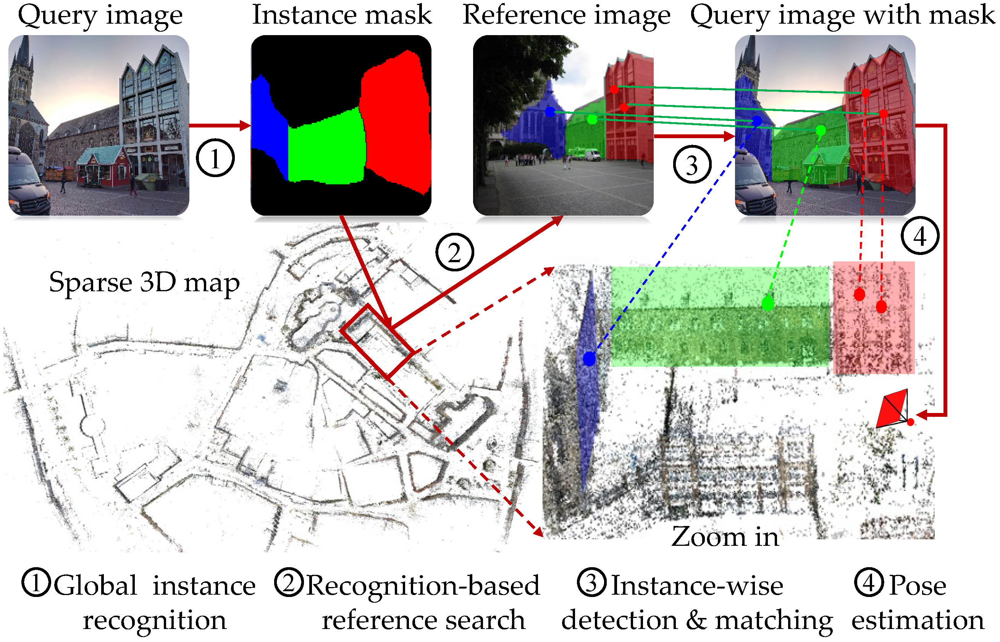

# Efficient Large-scale Localization by Global Instance Recognition
<p align="center">
  
</p>

* Full paper PDF: [Efficient Large-scale Localization by Global Instance Recognition](https://arxiv.org/abs/1911.11763).

* Authors: *Fei Xue, Ignas Budvytis, Daniel Olmeda Reino, Roberto Cipolla*

* Website: [psarlin.com/superglue](https://psarlin.com/superglue) for videos, slides, recent updates, and more visualizations.

## Dependencies
* Python 3 >= 3.5
* PyTorch >= 1.1
* OpenCV >= 3.4 (4.1.2.30 recommended for best GUI keyboard interaction, see this [note](#additional-notes))
* Matplotlib >= 3.1
* NumPy >= 1.18


## Data preparation 
Please follow instructions on the [VisualLocalization Benchmark](https://www.visuallocalization.net/datasets/) to download images  Aachen and RobotCar-Seasons datasets
* [Images of Aachen_v1.1 dataset](https://data.ciirc.cvut.cz/public/projects/2020VisualLocalization/Aachen-Day-Night/)
* [Images of RobotCar-Seasons dataset](https://data.ciirc.cvut.cz/public/projects/2020VisualLocalization/RobotCar-Seasons/)
* Global instances of Aachen_v1.1 dataset 
* Global instances of RobotCar-Seasons dataset

## Pretrained weights
* Local feature
* Recognition for Aachen_v1.1
* Recognition for RobotCar-Seasons 

## Testing 
* localization on Aachen_v1.1
```
./run_loc_aachn
```
* localization on RobotCar-Seasons
```
./run_loc_robotcar
```

## Training
* training recognition on Aachen_v1.1
```
./train_aachen
```

* training recognition on RobotCar-Seasons
```
./train_robotcar
```

## BibTeX Citation
If you use any ideas from the paper or code from this repo, please consider citing:

```txt
@inproceedings{xue2022efficient,
  author    = {Fei Xue and Ignas Budvytis and Daniel Olmeda Reino and Roberto Cipolla},
  title     = {Efficient Large-scale Localization by Global Instance Recognition},
  booktitle = {CVPR},
  year      = {2022}
}
```

## Legal Disclaimer
Magic Leap is proud to provide its latest samples, toolkits, and research projects on Github to foster development and gather feedback from the spatial computing community. Use of the resources within this repo is subject to (a) the license(s) included herein, or (b) if no license is included, Magic Leap's [Developer Agreement](https://id.magicleap.com/terms/developer), which is available on our [Developer Portal](https://developer.magicleap.com/).
If you need more, just ask on the [forums](https://forum.magicleap.com/hc/en-us/community/topics)!
We're thrilled to be part of a well-meaning, friendly and welcoming community of millions.
